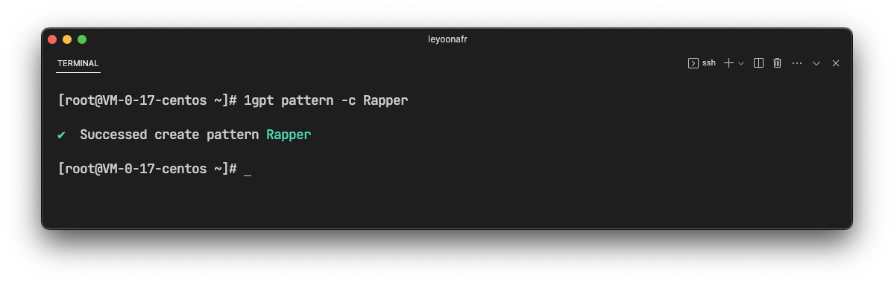
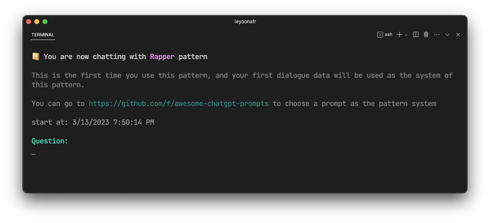

## Pattern user's guidance


### Create a pattern

```bash
1gpt pattern -c Rapper
```

You can use above command to create a pattern called Rapper

<p align="center">
   
</p>

<br/>


### Use a pattern

```bash
1gpt pattern -u Rapper
```

You can use the above command to open the `Rapper` pattern, and go directly into the conversation with the pattern.

<p align="center">
   
</p>

> If you do not enter the specified pattern name, an existing pattern selection list will be displayed

<br/>


### Pattern system

The `Question` you entered for the first time will be used as the system of the pattern.

> In this example, I will enter a prompt to designate chatGPT as the Rapper system. This prompt is copied from [awesome-chatgpt-prompts](https://github.com/f/awesome-chatgpt-prompts) repo.

<p align="center">
   
</p>

<br/>


### Continue chatting

Now we have a pattern called `Rapper` and we have assigned the system to it. The pattern can store your conversation and continue the previous conversation the next time the pattern is enabled.

<p align="center">
   
</p>

In the example above, when you open a pattern again, the content of your last conversation will be displayed at the top. And this time I asked `Rapper` to repeat the lyrics for me again, and he did it successfully.

<br/>

### Show pattern list

```bash
1gpt pattern -l
```

Using the above command will display all existing patterns.

<p align="center">
   
</p>

<br/>
 
### Remove a pattern

```bash
1gpt pattern -r ‘Motivational Speaker’
```

We can use the above command to delete the pattern named "Motivational Speaker".

> Same as `-u`, if you do not enter the specified pattern name, an optional list will be displayed.

<p align="center">
   
</p>

<br/>

### End

Hope you enjoy this new feature！
